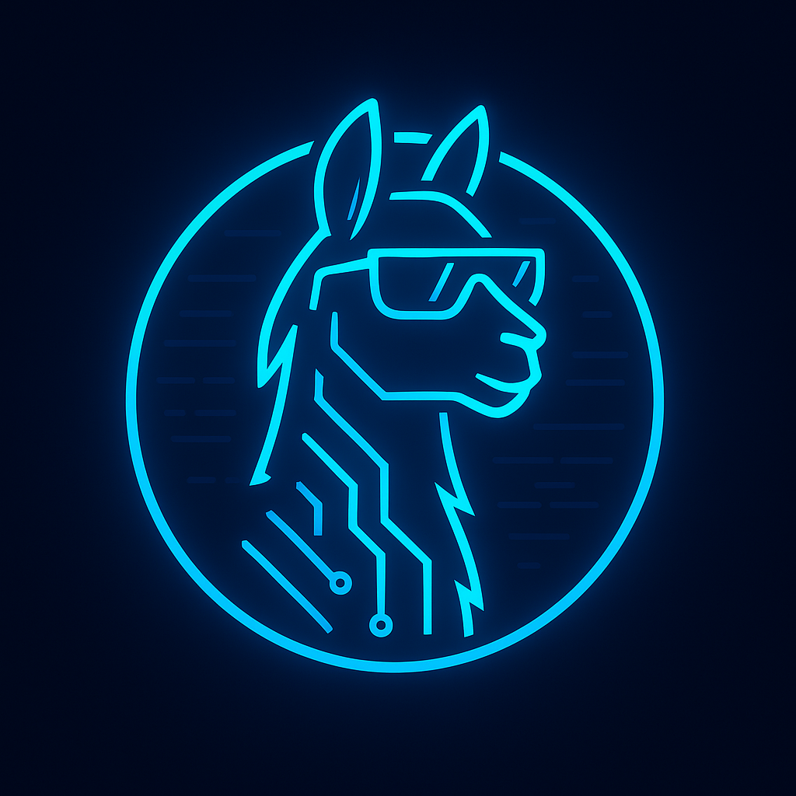

# 🐱‍💻 TinyLlama-X

TinyLlama-X is a lightweight, local AI terminal chat for Linux using TinyLlama models. No cloud. No browser. Just your terminal.

---

## 🚀 Features

- Text generation and terminal chat via TinyLlama
- Runs fully local (CPU, via llama-cpp-python)
- Intelligent assistant (smart): intent-aware, distro adapters, TLDR/man explain, safe propose→confirm→simulate→run
- Multiple launch scripts with smart-first preference (CLI auto-selects)
- Ubuntu desktop integration (menu launcher + icon)

---

## 🛠 Quick start

1) Clone and enter the repo

```bash
git clone https://github.com/120git/tinyllama-x.git
cd tinyllama-x
```

2) Create a Python virtual environment and install deps

```bash
python3 -m venv ai-env
source ai-env/bin/activate
pip install -r requirements.txt
```

3) Put your TinyLlama model somewhere accessible (example path shown)

```bash
mkdir -p ~/tinyllama-x
# place your GGUF, e.g.:
# ~/tinyllama-x/tinyllama-1.1b-chat-v1.0.Q4_K_M.gguf
```

4) Run the app

```bash
./bin/tinyllama-x        # preferred (auto-selects smartest launcher)
# or run smart assistant directly
./ai_terminal_llama_smart.sh
# or legacy launchers
./ai_terminal_llama_auto.sh
./ai_terminal_llama.sh
```

Type "exit" to quit.

Version/help:

```bash
./bin/tinyllama-x --version
./bin/tinyllama-x --help
```

---

## 🧰 Ubuntu desktop integration (menu launcher + icon)

Install the global CLI and a desktop launcher.

System-wide (requires sudo):

```bash
sudo bash scripts/install_ubuntu.sh --system
```

Per-user (no sudo):

```bash
bash scripts/install_ubuntu.sh --user
```

This installs:
- CLI: tinyllama-x (in /usr/local/bin or ~/.local/bin)
- Menu launcher: TinyLlama-X (App grid)
- Icon: hicolor theme (PNG)

Environment overrides supported by the launcher:
- TINYLLAMA_X_MODEL – absolute path to your .gguf model
- TINYLLAMA_X_VENV – path to your virtualenv (default: ~/ai-env)
- TINYLLAMA_X_DIR   – app install dir hint used by the CLI

Uninstall:

```bash
# System-wide
sudo bash scripts/uninstall_ubuntu.sh --system

# Per-user
bash scripts/uninstall_ubuntu.sh
```

---

## 🐳 Container Usage

TinyLlama-X is available as a secure, multi-architecture OCI container image with SBOM and Cosign signatures.

### Pull from GitHub Container Registry

```bash
# Pull latest image
docker pull ghcr.io/120git/tinyllama-x:latest

# Or pull a specific version
docker pull ghcr.io/120git/tinyllama-x:v0.1.0
```

### Run the container

The container runs as a non-root user (`app:app`, UID 10001) with a read-only root filesystem for enhanced security.

```bash
# Show help
docker run --rm -it ghcr.io/120git/tinyllama-x:latest --help

# Run with model cache mounted (recommended)
docker run --rm -it \
  --read-only \
  --tmpfs /tmp:exec \
  -v $HOME/.cache/tinyllamax:/home/app/.cache/tinyllamax \
  ghcr.io/120git/tinyllama-x:latest chat "install htop" --backend ollama --no-run

# Interactive mode with custom backend
docker run --rm -it \
  --read-only \
  --tmpfs /tmp:exec \
  -v $HOME/.cache/tinyllamax:/home/app/.cache/tinyllamax \
  ghcr.io/120git/tinyllama-x:latest plan --install vim --real
```

### Verify image signature and attestations

The container images are signed using [Cosign](https://github.com/sigstore/cosign) with keyless OIDC signatures and include SBOM (Software Bill of Materials) attestations.

```bash
# Install cosign (if not already installed)
# See: https://docs.sigstore.dev/cosign/installation/

# Verify image signature (keyless)
COSIGN_EXPERIMENTAL=1 cosign verify ghcr.io/120git/tinyllama-x:latest

# Verify and view SBOM attestation (SPDX format)
COSIGN_EXPERIMENTAL=1 cosign verify-attestation \
  --type spdx \
  ghcr.io/120git/tinyllama-x:latest | jq '.payload | @base64d | fromjson'

# Verify and view provenance attestation
COSIGN_EXPERIMENTAL=1 cosign verify-attestation \
  --type slsaprovenance \
  ghcr.io/120git/tinyllama-x:latest | jq '.payload | @base64d | fromjson'

# Use make target for verification (requires jq)
make verify-image
```

### Build locally

```bash
# Build single-arch image for local use
make image

# Or use the script directly
./scripts/build_image.sh

# Build development image with test tools (pytest, ruff, mypy)
make image-dev

# Run custom platform build
./scripts/build_image.sh --platform linux/arm64
```

**Note**: Local builds require Docker with buildx and proper network/SSL access to PyPI. In CI/CD environments (GitHub Actions), all network dependencies are available and the build will succeed.

To test the built image:

```bash
# After building locally
docker run --rm -it tinyllamax:local --help

# Test with a simple command
docker run --rm -it tinyllamax:local settings
```

### Security features

- **Non-root user**: Runs as `app:app` (UID 10001)
- **Read-only root filesystem**: All system files are immutable
- **No SSH keys or secrets**: Clean image with no embedded credentials
- **Minimal attack surface**: Based on `python:3.12-slim` with no unnecessary tools
- **Dropped capabilities**: Runs with minimal Linux capabilities
- **SBOM included**: Full software bill of materials for vulnerability tracking
- **Signed images**: Cosign signatures for supply chain security

---

## 📦 Key files

```
tinyllama-x/
├─ bin/
│  └─ tinyllama-x                 # Global CLI launcher
├─ scripts/
│  ├─ install_ubuntu.sh           # Installer (system/user)
│  └─ uninstall_ubuntu.sh         # Uninstaller (system/user)
├─ resources/
│  └─ tinyllama-x.desktop         # Desktop entry template
├─ ai_terminal_llama_smart.sh     # Intelligent assistant entry (intent/RAG/safe exec)
├─ ai_terminal_llama_auto.sh      # Auto-start Llama script
├─ ai_terminal_llama.sh           # Chat launcher
├─ ai_terminal.sh                 # Demo menu launcher
├─ lib/                           # Intelligence modules (intent, distro, adapters, RAG, executor, history)
│  ├─ intent.py
│  ├─ distro.py
│  ├─ pm_adapter.py
│  ├─ rag.py
│  ├─ executor.py
│  └─ history.py
├─ tinyllama_x_smart.py           # Smart assistant Python loop
├─ INTELLIGENCE.md                # Smart assistant docs
├─ run-llama.py                   # Python-based runner (older)
├─ run-tinyllama.py               # Python-based runner (older)
├─ requirements.txt
├─ LICENSE
└─ README.md
```

---

## 📝 Notes

- Keep large model files out of Git (use .gitignore).
- Update pip/Python for best performance.
- Optimized for Linux; macOS may work with minor tweaks.

For details about the intelligent assistant (intents, risk levels, TLDR/man integration, history), see `INTELLIGENCE.md`.

---

## 📜 License

MIT License. See LICENSE for details.


